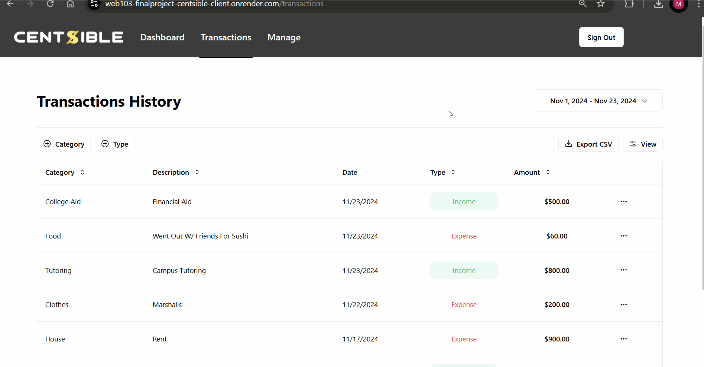
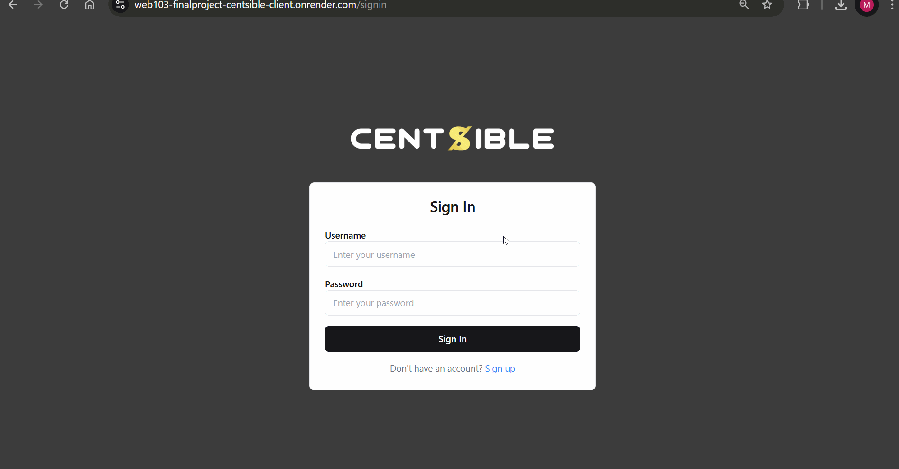

# Centsible

CodePath WEB103 Final Project

Designed and developed by: **Arihant Tiwari** & **Md Wasiul Islam** 

🔗 Link to deployed app: [Render App](https://web103-finalproject-centsible-client.onrender.com/)

## About

### Description and Purpose

Centsible is an intuitive, full-stack web app designed to provide users with a streamlined way to manage daily expenses and gain financial clarity. With its easy-to-use interface, users can quickly log expenditures, categorize them (like food, travel, entertainment), and generate visual summaries to monitor spending patterns. The app offers customization options, allowing users to create their own categories, set personalized spending limits, and get notified when they approach their budget cap. 

The goal of Centsible is to make budgeting simple, smart, and tailored to users’ unique lifestyles. It's not just about tracking expenses, but about helping users stay financially empowered. Whether saving for a big goal or simply keeping spending in check, the app provides real-time insights, encourages better financial habits, and helps users make mindful decisions. By demystifying personal finance and providing actionable data, Centsible makes it easier to achieve long-term financial wellness.

### Inspiration

Centsible is inspired by the idea that financial health is a key component of overall well-being. Managing money can be daunting, especially for young adults, students, and individuals new to budgeting. Centsible aims to simplify the process, remove the stress, and empower users to take control of their finances with confidence. The app is designed to be user-friendly, visually engaging, and informative, providing a positive experience that motivates users to build better money habits. By combining practicality with personalization, Centsible fosters a sense of financial awareness, responsibility, and success.

## Tech Stack

Frontend: React, Tailwind CSS

Backend: Express.js, PostgreSQL

## Features

### ✅ Log Expenses and Income

Users can Log and track new Expenses or Income, provide details like Amount, category, description, date, 


### ✅ Transactions Page

This page provides them summary of all their transactions so far, and all realted info regarding each transaction. 



### ✅ User Authentication

Users will be able to properly authenticate with multiple ways so they can securely access their data 



### ✅ Filter Transactions 

Users will be able to filter transactions by date range, category, amount etc.


### ✅ Manage Categories

To properly categorize each transaction into groups, users will be able to create their own personal categories. 


## Installation Instructions

To run the Centsible app locally, follow these steps:

### Prerequisites

Ensure you have the following installed on your machine:
- Node.js (v14 or higher)
- npm (v6 or higher)
- PostgreSQL

### Backend Setup

1. Clone the repository:
    ```bash
    git clone https://github.com/yourusername/web103_finalproject_Centsible.git
    cd web103_finalproject_Centsible/server
    ```

2. Install dependencies:
    ```bash
    npm install
    ```

3. Create a `.env.local` file in the `server` directory and add your PostgreSQL database credentials:
    ```
    DB_USER=your_db_user
    DB_PASSWORD=your_db_password
    DB_HOST=localhost
    DB_PORT=5432
    DB_NAME=centsible
    ```

4. Run database migrations:
    ```bash
    npx sequelize-cli db:migrate
    ```

5. Start the backend server:
    ```bash
    npm start
    ```

### Frontend Setup

1. Navigate to the frontend directory:
    ```bash
    cd ../client
    ```

2. Install dependencies:
    ```bash
    npm install
    ```

3. Create a `.env.local` file in the `frontend` directory and add the backend API URL:
    ```
    NEXT_PUBLIC_API_URL=http://localhost:5000
    ```

4. Start the frontend development server:
    ```bash
    npm run dev
    ```

### Access the App

Open your browser and navigate to `http://localhost:3000` to access the Centsible app.

